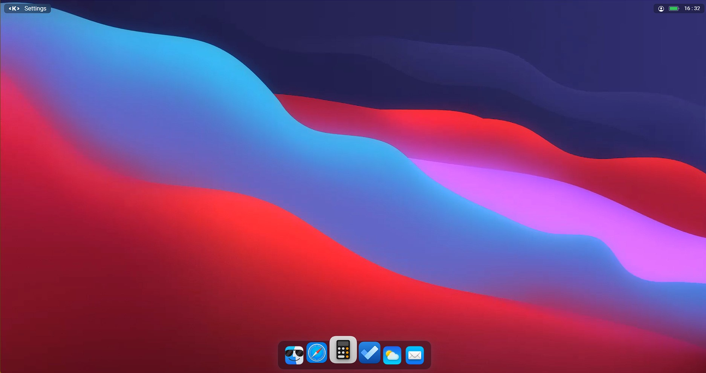
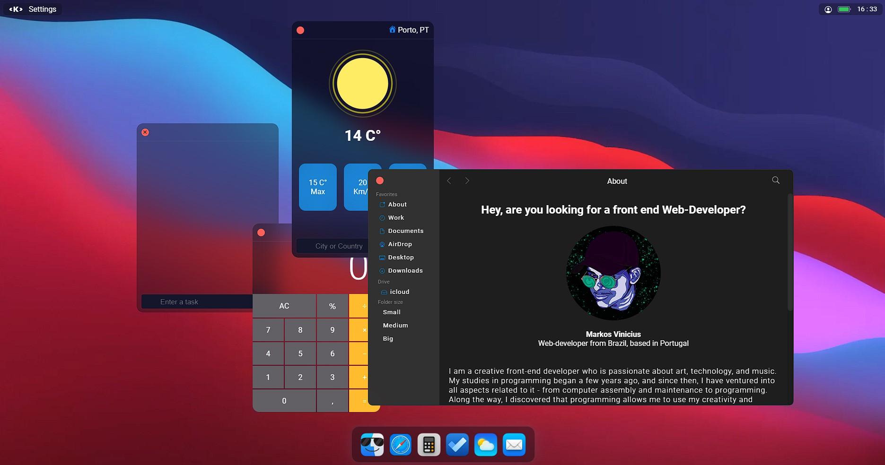
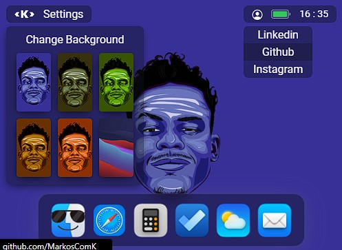

# Personal Portfolio

This is my personal portfolio, developed to show and register my evolution as a front-end web developer

## Tabela de conteúdos

- [Overview](#overview)
  - [Goals](#goals)
  - [Screenshots](#screenshots)
  - [Links](#links)
- [The process](#the-process)
  - [Maded with](#maded-with)
  - [what i`m learning](#what-im-learning)
  - [timeline](#timeline)
- [Author](#author)
- [Final Considerations](#final-considerations)


## Overview

### Goals

Remake my old portfolio with an more creative presentations and also learning new technologies.

- Deliver an amazing *User Experience*
- Create a beaty *User Interface*
- Create a good and readable code 
- Make it responsive in any device 

### screenshots


Onload



Apps




TopBar





### Links

- Website Link: [clique para acessar](https://markoscomk.netlify.app)

## The process

### Maded with

- Typescript
- React.js
- Styled components
- Figma

### What i`m learning


This is my first project in react using typescript and styled components

below the root colors
```css
 :root {
        --font-color: #f9fafb;
        --theme-bg-color: rgba(16, 18, 27, 0.4);
        --border-color: rgba(113, 119, 144, 0.25);
        --theme-color: #f9fafb;
        --inactive-color: rgb(113, 119, 144, 0.78);
        --body-font: "Poppins", sans-serif;
        --hover-menu-bg: rgba(12, 15, 25, 0.3);
        --content-title-color: #999ba5;
        --content-bg: rgb(146, 151, 179, 0.13);
        --button-inactive: rgb(249, 250, 251, 0.55);
        --dropdown-bg: #21242d;
        --dropdown-hover: rgb(40 46 60);
        --popup-bg: rgb(22 25 37);
        --search-bg:  #14162b;
        --overlay-bg: rgba(36, 39, 59, 0.3);
        --scrollbar-bg: rgb(1, 2, 3, 0.4);
        --red-btn: #ff6057;
        --yellow-btn: #febc2e;
        --green-btn: #28c841;
        /* Glass effect */
        backdrop-filter: blur(20px);
        -webkit-backdrop-filter: blur(20px);
        /* border radius */
        border-radius: 14px;
        /* WeatherApp */
        --dark-blue: rgba(11,12,30, 0.7);
        --light-blue: rgba(29,147,235,0.5);
        --gray: #85858e;
    }
```


### Timeline

First version of my portfolio started in 05 of september 2021 and second version (actual) started in january/2023


## Author

- linkedin - [@MarkosComK](https://www.linkedin.com/in/markos-soares/)
- Github - [MarkosComK](https://github.com/MarkosComK)
- Frontend Mentor - [@MarkosComK](https://www.frontendmentor.io/profile/MarkosComK)
- instagram - [@MarkosComK](https://www.instagram.com/markoscomk/)

## Final considerations

If you want to give me some feedback, tip, or just talk to me, feel free to contact me through any of my social medias.

"Tudo acontece por uma razão e esta existe para me[/te] ajudar." 😎

<br>

<div>
  <a href="https://www.linkedin.com/in/markos-soares/">
    
  </a> 
  <a href="https://instagram.com/MarkosComK" target="_blank"></a>
  <a href="https://twitter.com/markoscomk" target="_blank"></a>
 <a href = "mailto:markoscomks@gmail.com"></a>
</div>

<br>